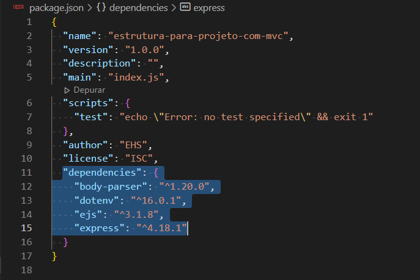
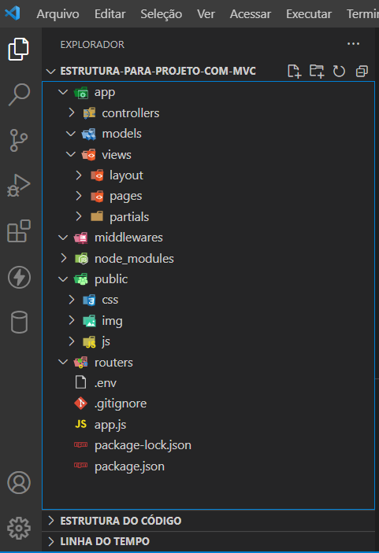

# Modelo Estrutural para projetos

## Objetivo

Olá, seja bem vindo.
O objetivo deste Repositório é oferecer uma estrutura modelo, simples porém eficiente, para iniciar um projeto.
Neste em específico ao clonar este repositório e iniciá-lo, automaticamente você terá instalado as seguintes dependências
 Express
 ejs
 dotenv
 body-parse

## Como usar

### Clonar
* Após clonar este repositório em seu computador, utilize o prompt de comando ou terminal do VSCode. 
Pelo terminal encontre o caminho até o diretório. Ex:

C:\User\Projetos\Modelos\Estrutura-para-Projeto-com-MVC>

### Instalar dependencias
* Após acessar o diretório Estrutura-para-Projeto-com-MVC, Digite o seguinte comando no terminal:

npm install   ou   npm i

Ao acessar o arquivo package.json, na parte de dependências irá aparecer estas:

    

## Conteúdo (Diretórios e  Arquivos Iniciais)

app/	 => 	controllers/
				models/
				views/		=>	layout/
								pages/
								partial	/	=>	footer.ejs
												header.ejs
public/	=>		css/
				img/
				js/
routers/
.gitingore
.env
app.js
package-lock.json
package.json
README.md

    

## Observação
* Após isto Use e Abuse, modifique a estrutura de acordo com a necessidade do seu projeto. Adicione ou retire.