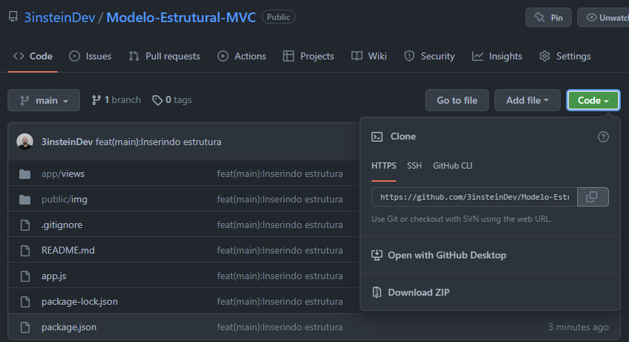
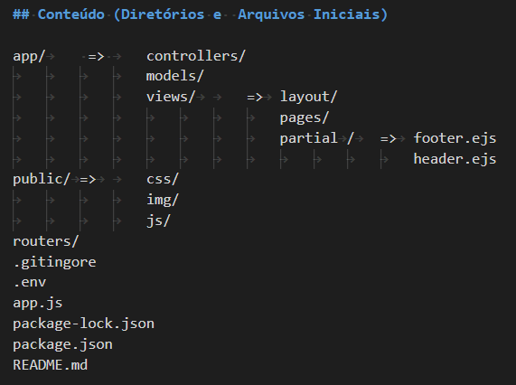

# Modelo Estrutural para projetos

## Objetivo

O objetivo deste Repositório é oferecer uma estrutura modelo, simples porém eficiente, para iniciar um projeto.
Ao clonar este repositório e iniciá-lo, automaticamente você terá instalado as seguintes dependências:

  * Express
  * ejs
  * dotenv
  * body-parse

## Como usar

### Clonar

Para clonar siga os seguintes passos:

* Aqui no GitHub, na página principal deste repositório, clique em => código

    

* Copie a URL deste repositório
* Use o prompt de comando/ terminal do VSCode e acesse um diretório para o qual deseja clonar
* Digite git clone (clonar git) e cole a URL que você copiou anteriormente.

git clone https://github.com/3insteinDev/Modelo-Estrutural-MVC.git

* Após clonado, acesse o diretório pelo terminal, digitando o seguinte comando:

cd ./ESTRUTURA-PARA-PROJETO-COM-MVC

### Instalar dependencias
* Após acessar o diretório Estrutura-para-Projeto-com-MVC, Digite o seguinte comando no terminal:

npm install   ou   npm i

Ao acessar o arquivo package.json, na parte de dependências irá aparecer estas:

    

## Conteúdo (Diretórios e  Arquivos Iniciais)

    

    

## Observação
* Após isto Use e Abuse, modifique a estrutura de acordo com a necessidade do seu projeto. Adicione ou retire.